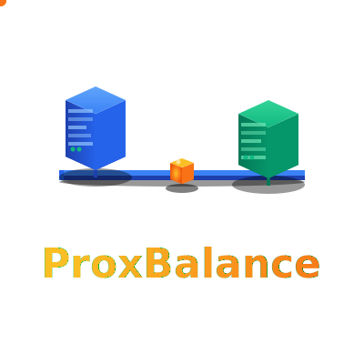
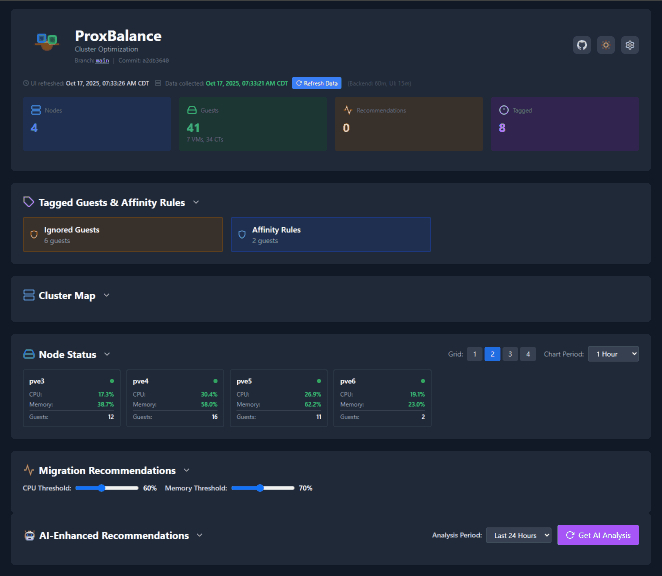
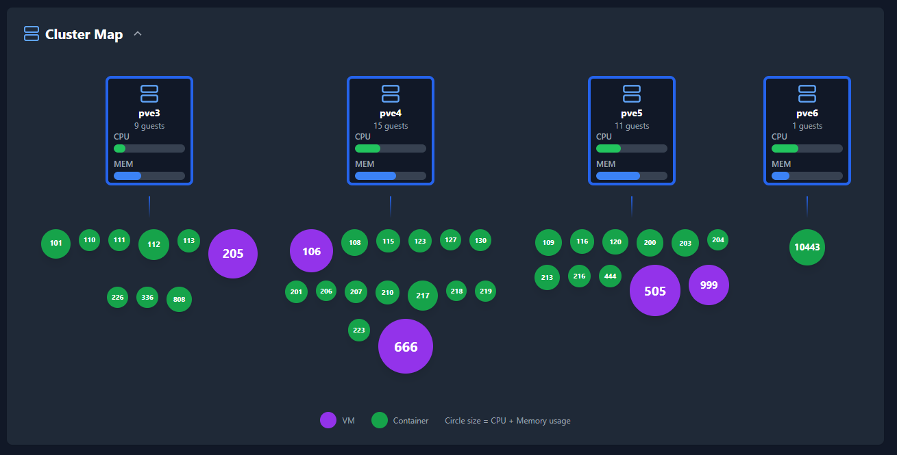
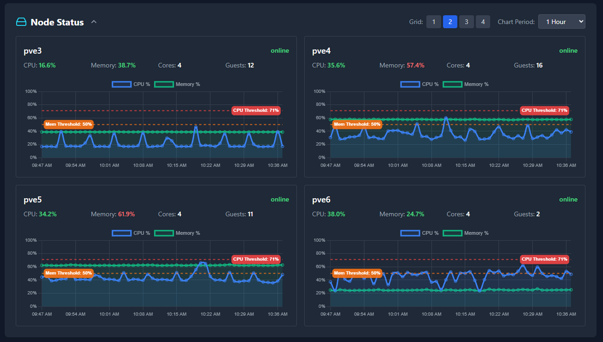
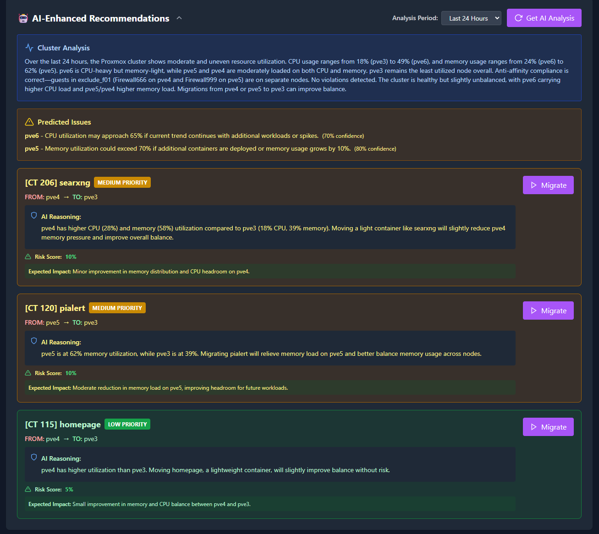

<div align="center">



<br/>
<br/>


[](https://opensource.org/licenses/MIT)
[](https://www.python.org/downloads/)
[](https://www.proxmox.com/)

**Intelligent cluster monitoring and VM/CT migration for Proxmox VE**

[Quick Start](#quick-start) | [Features](#features) | [Documentation](docs/README.md)

</div>

---

## What is ProxBalance?

ProxBalance is a web-based cluster analyzer and migration manager for Proxmox VE. It monitors your cluster in real time, generates intelligent migration recommendations using a penalty-based scoring algorithm, and can automate load balancing across your nodes.

<div align="center">

</div>

---

## Features

**Monitoring**
- Live CPU, memory, IOWait, and load metrics with sparkline visualizations
- Interactive cluster map with 5 view modes (CPU, Memory, Allocated, Disk I/O, Network)
- Multi-timeframe historical charts (1 hour to 1 year)
- Dark mode support

**Migration**
- One-click migrations with real-time progress tracking and transfer speed
- Penalty-based scoring with suitability ratings (0-100%)
- Node maintenance mode with automatic evacuation
- Anti-affinity rules via VM/CT tags
- Storage compatibility validation

**Automation**
- Scheduled migrations with configurable time windows and blackout periods
- Safety checks: cluster health, quorum, resource limits, rollback detection
- Distribution balancing for even guest counts
- Dry-run mode for testing

**AI Analysis** (optional)
- OpenAI, Anthropic, or Ollama (local LLM) integration
- Predictive workload analysis and trend detection
- Natural language reasoning for each recommendation

**Notifications**
- Pushover, Email (SMTP), Telegram, Discord, Slack, and custom webhooks
- Configurable triggers for migration start, completion, and failure

See the [complete feature list](docs/FEATURES.md) for details.

---

## Quick Start

### Installation

Run on your Proxmox host:

```bash
bash -c "$(wget -qLO - https://raw.githubusercontent.com/Pr0zak/ProxBalance/main/install.sh)"
```

The installer creates an unprivileged LXC container, installs all dependencies, configures services, and sets up API token authentication automatically.

### Access

Open `http://<container-ip>` in your browser.

---

## Screenshots

<div align="center">
  <table>
    <tr>
      <td align="center" width="50%">
        
        <br/>
        <b>Dashboard Overview</b>
      </td>
      <td align="center" width="50%">
        
        <br/>
        <b>Interactive Cluster Map</b>
      </td>
    </tr>
    <tr>
      <td align="center" width="50%">
        
        <br/>
        <b>Detailed Node Metrics</b>
      </td>
      <td align="center" width="50%">
        
        <br/>
        <b>AI-Powered Recommendations</b>
      </td>
    </tr>
  </table>
</div>

---

## Documentation

| Document | Description |
|----------|-------------|
| [Installation Guide](docs/INSTALL.md) | Setup and configuration |
| [Usage Guide](docs/USAGE.md) | Workflows and UI guide |
| [Configuration Reference](docs/CONFIGURATION.md) | All config.json options |
| [Scoring Algorithm](docs/SCORING_ALGORITHM.md) | Penalty-based scoring system |
| [Automated Migrations](docs/AUTOMATION.md) | Scheduling and safety |
| [AI Features](docs/AI_FEATURES.md) | AI provider setup |
| [Notifications](docs/NOTIFICATIONS.md) | Alert providers and setup |
| [API Reference](docs/API.md) | REST API endpoints |
| [Troubleshooting](docs/TROUBLESHOOTING.md) | Common issues and solutions |
| [Contributing](docs/CONTRIBUTING.md) | Development guidelines |

[Full documentation index](docs/README.md)

---

## System Requirements

- **Proxmox VE** 7.0 or higher
- **Resources**: 2 GB RAM, 2 CPU cores, 8 GB disk (minimum)
- **Network**: Connectivity to all cluster nodes on port 8006
- **Access**: Root access to Proxmox host

---

## Security

- API token authentication (no passwords stored)
- Runs in an unprivileged LXC container
- Designed for local network operation
- Optional SSL/TLS support

---

## Support

- **Bug Reports**: [GitHub Issues](https://github.com/Pr0zak/ProxBalance/issues)
- **Feature Requests**: [GitHub Discussions](https://github.com/Pr0zak/ProxBalance/discussions)
- **Troubleshooting**: [docs/TROUBLESHOOTING.md](docs/TROUBLESHOOTING.md)

---

## License

MIT License - see [LICENSE](LICENSE) for details.

---

<div align="center">

[Documentation](docs/README.md) | [Installation](docs/INSTALL.md) | [GitHub](https://github.com/Pr0zak/ProxBalance)

</div>
