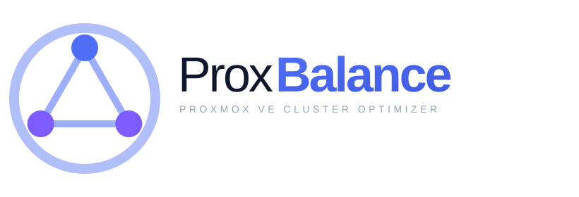
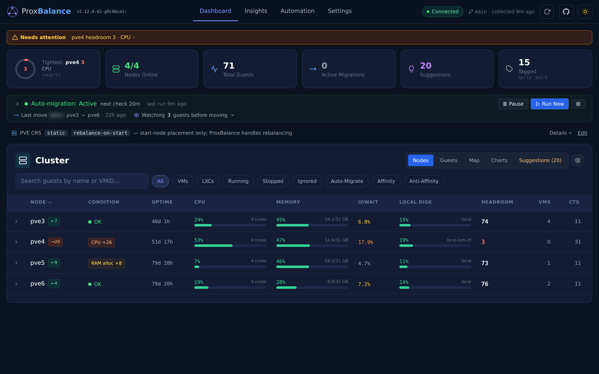
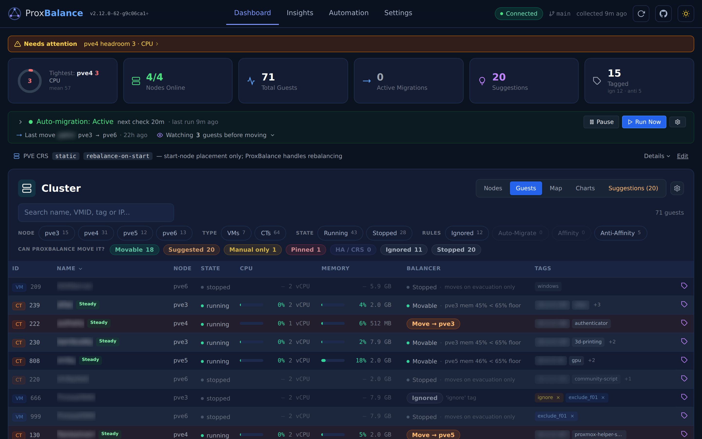
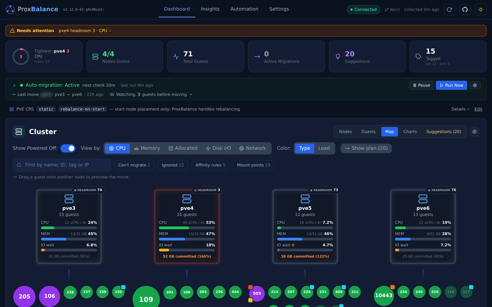
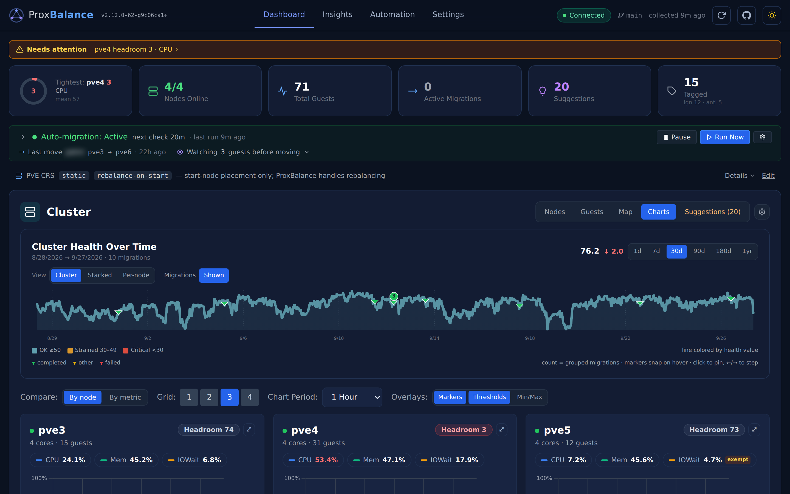
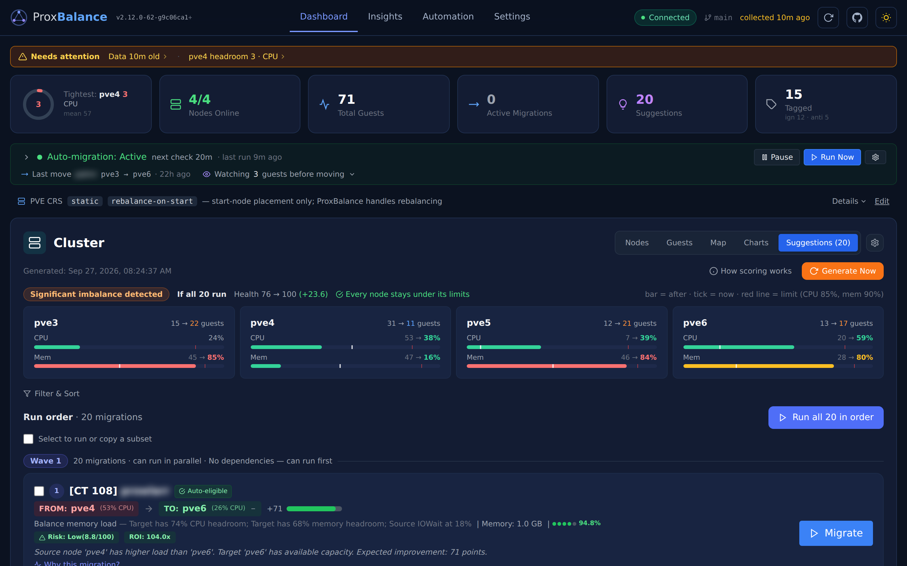
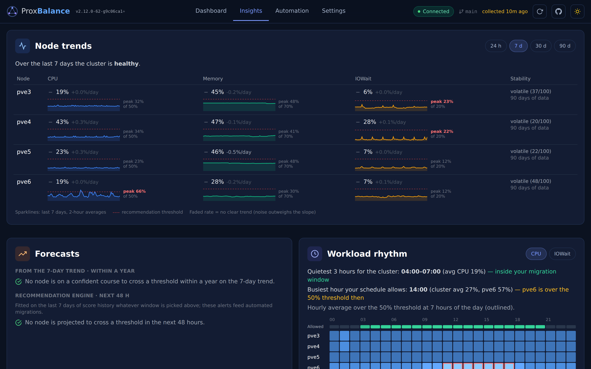
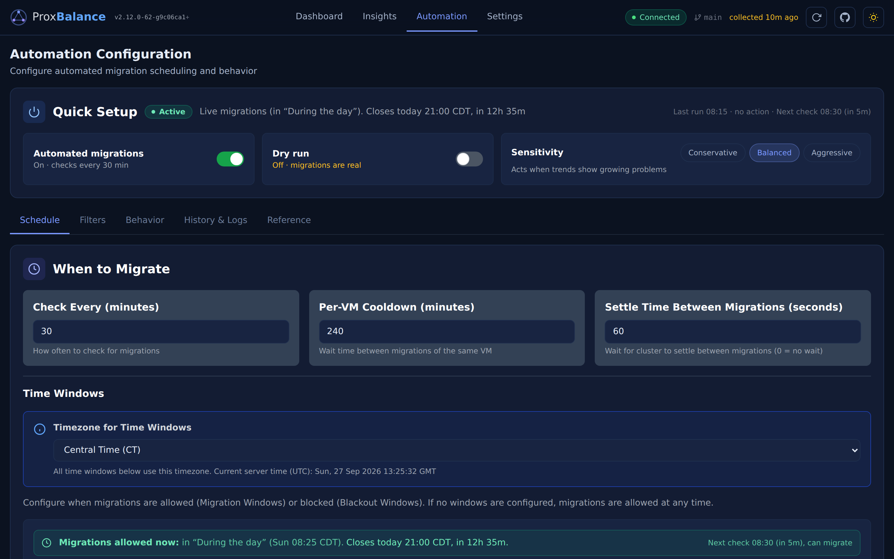
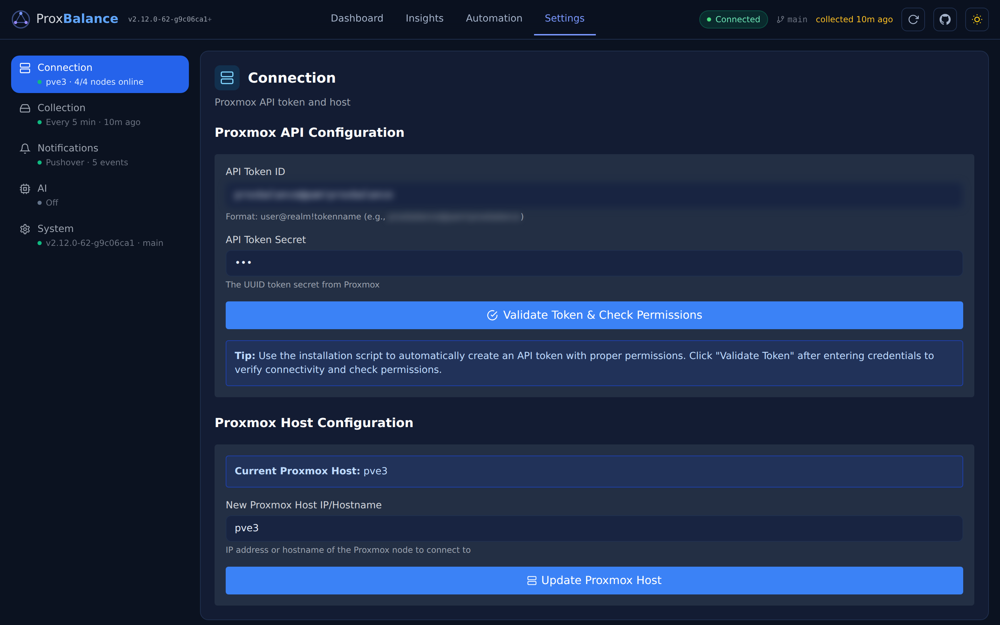

<div align="center">

<picture>
  <source media="(prefers-color-scheme: dark)" srcset="assets/logo_v3_dark.svg" width="700"/>
  <source media="(prefers-color-scheme: light)" srcset="assets/logo_v3.svg" width="700"/>
  
</picture>

<br/>
<br/>


[](https://opensource.org/licenses/MIT)
[](https://www.python.org/downloads/)
[](https://www.proxmox.com/)

**Intelligent cluster monitoring and VM/CT migration for Proxmox VE**

[Quick Start](#quick-start) | [Features](#features) | [Documentation](docs/README.md)

</div>

---

## What is ProxBalance?

ProxBalance is a web-based cluster analyzer and migration manager for Proxmox VE. It monitors your cluster in real time, generates intelligent migration recommendations using a penalty-based scoring algorithm, and can automate load balancing across your nodes.

<div align="center">

</div>

---

## Features

**Monitoring**
- Live CPU, memory, IOWait and disk metrics, with one **Headroom** score per node (0–100, higher means more room) and a single colour scale everywhere
- A *Needs attention* strip that names the node and resource under pressure
- Interactive cluster map with 5 view modes (CPU, Memory, Allocated, Disk I/O, Network), a find bar, and drag-a-guest-to-preview-the-move
- Cluster health over time (1 day to 1 year) with migration markers that snap on hover; click to pin a moment and step between migrations with ←/→
- Guests tab that answers "can ProxBalance move it?" for every guest (movable, suggested, manual only, pinned, HA/CRS, ignored)
- Light and dark modes, and a layout that works on phones

**Insights**
- Per-node trends with sparklines against the recommendation thresholds (24 h to 90 d)
- Forecasts of which node will cross a threshold, and when
- Workload rhythm heatmap showing the quietest hours and whether they fall inside your migration window
- Measured outcomes of past migrations (before and after)

**Migration**
- One-click migrations with real-time progress tracking and transfer speed
- Suggestions as one run-ordered list in waves, with batch impact per node, subset selection and conflict what-ifs
- Penalty-based scoring (see [Scoring Algorithm](docs/SCORING_ALGORITHM.md))
- Node maintenance mode with an evacuation plan that shows where each guest will land
- Anti-affinity rules via VM/CT tags
- Storage compatibility validation

**Automation**
- Scheduled migrations with configurable time windows and blackout periods (wall-clock `OnCalendar` schedule, resilient to crashes), with a live "migrations allowed now" status
- Quick Setup: on/off, dry run and sensitivity in one place; every page saves through one unsaved-changes bar
- Intelligent observation gating — only migrate when a recommendation persists across multiple cycles
- Safety checks: cluster health, quorum, resource limits, rollback detection
- Distribution balancing for even guest counts
- Dry-run mode for testing; the automation test endpoint (`POST /api/automigrate/test`) always runs as a dry run

**AI Analysis** (optional)
- OpenAI, Anthropic, or Ollama (local LLM) integration
- Predictive workload analysis and trend detection
- Natural language reasoning for each recommendation

**Notifications**
- Pushover, Email (SMTP), Telegram, Discord, Slack, and custom webhooks
- Configurable triggers for migration start, completion, and failure
- Test each channel on its own and see a per-channel result

See the [complete feature list](docs/FEATURES.md) for details.

---

## Quick Start

### Installation

Run on your Proxmox host:

```bash
bash -c "$(wget -qLO - https://raw.githubusercontent.com/Pr0zak/ProxBalance/main/install.sh)"
```

The installer creates an unprivileged LXC container, installs all dependencies, configures services, and sets up API token authentication automatically.

### Access

Open `http://<container-ip>` in your browser.

---

## Screenshots

The dashboard's Cluster section has five tabs (Nodes, Guests, Map, Charts and Suggestions), each a different view of the same data. Every view has its own link, for example `#/dashboard/map` or `#/automation/filters`. Guest names in these screenshots are blurred.

<div align="center">
  <table>
    <tr>
      <td align="center" width="50%">
        
        <br/>
        <b>Nodes</b> — headroom, condition and top consumers per node
      </td>
      <td align="center" width="50%">
        
        <br/>
        <b>Guests</b> — filters and a balancer verdict for every guest
      </td>
    </tr>
    <tr>
      <td align="center" width="50%">
        
        <br/>
        <b>Map</b> — cluster map with move preview (5 view modes)
      </td>
      <td align="center" width="50%">
        
        <br/>
        <b>Charts</b> — cluster health with migration markers, per-node history
      </td>
    </tr>
    <tr>
      <td align="center" width="50%">
        
        <br/>
        <b>Suggestions</b> — run order, batch impact per node, conflict what-ifs
      </td>
      <td align="center" width="50%">
        
        <br/>
        <b>Insights</b> — trends, forecasts, workload rhythm and outcomes
      </td>
    </tr>
    <tr>
      <td align="center" width="50%">
        
        <br/>
        <b>Automation</b> — quick setup, live schedule status, filters
      </td>
      <td align="center" width="50%">
        
        <br/>
        <b>Settings</b> — sections with live status; secrets are never shown
      </td>
    </tr>
  </table>
</div>

---

## Documentation

| Document | Description |
|----------|-------------|
| [Installation Guide](docs/INSTALL.md) | Setup and configuration |
| [Usage Guide](docs/USAGE.md) | Workflows and UI guide |
| [Configuration Reference](docs/CONFIGURATION.md) | All config.json options |
| [Scoring Algorithm](docs/SCORING_ALGORITHM.md) | Penalty-based scoring system |
| [Automated Migrations](docs/AUTOMATION.md) | Scheduling and safety |
| [AI Features](docs/AI_FEATURES.md) | AI provider setup |
| [Notifications](docs/NOTIFICATIONS.md) | Alert providers and setup |
| [API Reference](docs/API.md) | REST API endpoints |
| [Troubleshooting](docs/TROUBLESHOOTING.md) | Common issues and solutions |
| [Contributing](docs/CONTRIBUTING.md) | Development guidelines |

[Full documentation index](docs/README.md)

---

## System Requirements

- **Proxmox VE** 7.0 or higher
- **Resources**: 2 GB RAM, 2 CPU cores, 8 GB disk (minimum)
- **Network**: Connectivity to all cluster nodes on port 8006
- **Access**: Root access to Proxmox host

---

## Security

- API token authentication (no passwords stored)
- Secrets (Proxmox token secret, AI keys, notification credentials) are never returned by the API; the UI shows a masked placeholder, and saving the placeholder keeps the stored value
- Runs in an unprivileged LXC container
- Designed for local network operation
- Optional SSL/TLS support

---

## Support

- **Bug Reports**: [GitHub Issues](https://github.com/Pr0zak/ProxBalance/issues)
- **Feature Requests**: [GitHub Discussions](https://github.com/Pr0zak/ProxBalance/discussions)
- **Troubleshooting**: [docs/TROUBLESHOOTING.md](docs/TROUBLESHOOTING.md)

---

## License

MIT License - see [LICENSE](LICENSE) for details.

---

<div align="center">

[Documentation](docs/README.md) | [Installation](docs/INSTALL.md) | [GitHub](https://github.com/Pr0zak/ProxBalance)

</div>
